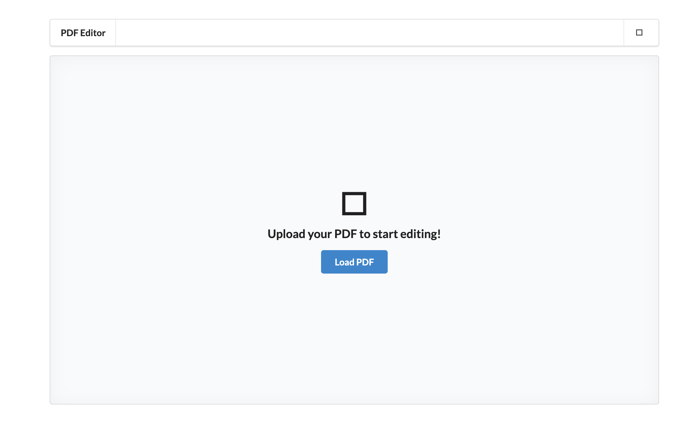
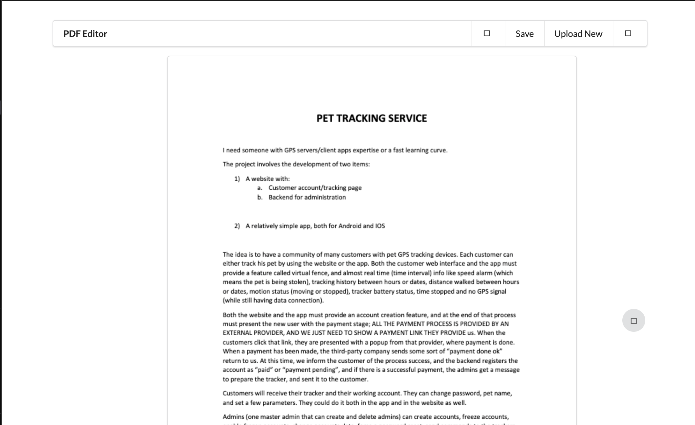
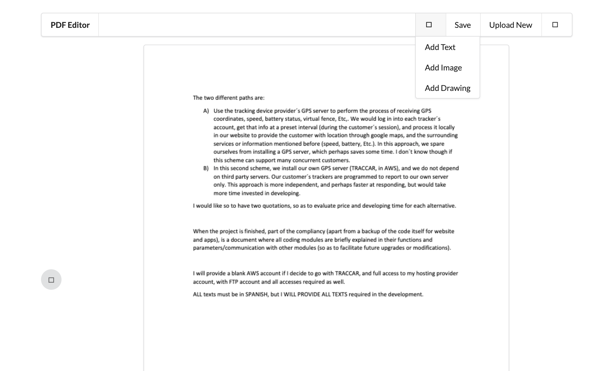
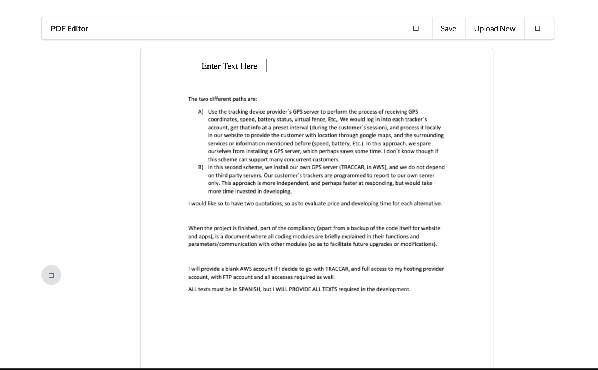

# PDF Editor & View in React WEB

This is a PDF Editor that allows you to add images and drawings to your pdf directly from your browser.

## The Screenshots of the PDF Editor & View are Shown Below

## Clone Project in MAC or Windows
Copy the Below Line of PDF Editor Clone Project 

git clone https://github.com/Nafeel483/PDF_Edit_See_React.git

## How to Run

* yarn install

    OR

* npm install

* yarn start

    OR

* npm start
